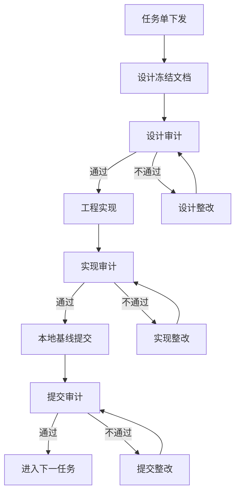

# Sprint 3 架构规范

- 版本：V1.0
- 更新时间：2026-04-16
- 作者：技术架构师
- 状态：待审计

## 一、串行审计门禁强制规则

Sprint 3 所有任务必须执行以下流程：

```text
任务单下发
  -> 设计冻结
  -> 设计审计通过
  -> 工程实现
  -> 实现审计通过
  -> 本地基线提交
  -> 提交审计通过
  -> 下一任务
```

任何任务不得跳过审计步骤。若审计发现问题，必须进入同编号修复任务，例如 `TASK-013A1`、`TASK-013B1`。

## 二、设计冻结到实现的流程图



## 三、审计意见书编号规则

1. 审计意见书编号由审计官连续编号。
2. 设计审计、实现审计、提交审计均必须占用编号。
3. 自动接力消息不得替代正式审计意见书。
4. 缺失编号必须在状态标注文档中记录。
5. 审计通过不代表生产发布通过。

## 四、代码提交前置审计要求

代码提交前必须满足：

1. 实现审计通过。
2. 暂存清单经白名单确认。
3. `git diff --cached --check` 通过。
4. 禁改路径扫描通过。
5. 运行产物未进入暂存。
6. 交付证据已输出。
7. 不得使用 `git add .` 或 `git add -A`。

## 五、安全关键路径定义

以下路径属于安全关键路径，必须执行更严格审计：

| 类型 | 范围 | 审计要求 |
|---|---|---|
| 权限 | action/resource/user permission | 必须 fail closed，必须安全审计 |
| 财务 | Payment Entry / GL / AR/AP / Purchase Invoice | 必须设计审计，禁止直接写 ERPNext |
| 库存 | Stock Entry / Stock Ledger / Warehouse | 必须 outbox 或只读边界审计 |
| ERPNext 写入 | REST POST/PUT/PATCH/DELETE | 必须使用 adapter/outbox，禁止裸调用 |
| 前端写入口 | 按钮、菜单、action、动态注入 | 必须接入 TASK-010 门禁 |
| Outbox Worker | claim/lease/retry/dead | 必须接入 TASK-009 状态机规范 |
| 审计日志 | 安全审计/操作审计 | 必须脱敏，禁止记录凭据 |

## 六、公共基座强制引用

1. 权限与审计：必须引用 TASK-007。
2. ERPNext 集成：必须引用 TASK-008。
3. Outbox 状态机：必须引用 TASK-009。
4. 前端门禁：必须引用 TASK-010。
5. 平台 CI：必须引用 REL-004。

## 七、生产发布前置条件

生产发布前必须满足：

1. Sprint 2 审计缺口补齐。
2. Sprint 3 当前任务全链路审计通过。
3. GitHub Hosted Runner 四项 gate 通过。
4. branch protection required checks 配置完成。
5. ERPNext 生产联调通过。
6. 敏感信息扫描通过。
7. 总调度签字确认。

## 八、架构禁止事项

1. 禁止裸连 ERPNext 写接口。
2. 禁止未审计 outbox worker。
3. 禁止前端绕过 FastAPI。
4. 禁止 200 + 空数据伪成功。
5. 禁止权限源失败时 fail open。
6. 禁止 unknown config 静默跳过。
7. 禁止把本地通过冒充平台通过。
8. 禁止声明未完成的生产发布状态。
