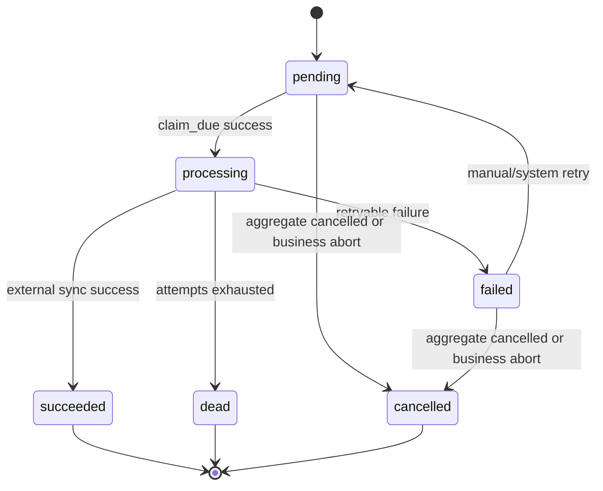

# TASK-009 Outbox 公共状态机规范

- 模块：Outbox 公共状态机
- 版本：V1.0（设计冻结）
- 更新时间：2026-04-16
- 前置：TASK-008D 审计通过（HEAD `e468231102e182faa85cb49f0bb8694bde65a650`）
- 适用范围：TASK-002 / TASK-003 / TASK-004 / TASK-006 既有 outbox，以及 Sprint 2 新增 outbox 模块

## 一、目标与边界

### 1.1 目标
统一 outbox 的事件键、幂等、状态机、claim/lease、重试、worker 前置校验、dry-run/diagnostic 与审计规则，降低跨模块重复返工和语义漂移风险。

### 1.2 边界
1. 本文档只冻结规范，不改任何业务代码。
2. 不强制一次性重构 TASK-002/003/004/006 全量实现。
3. 只定义公共模板与回迁路径；具体改造进入 TASK-009B 及后续任务。

---

## 二、现有 Outbox 实现对比

| 模块 | 表/模型 | 服务类 | Worker 类 | event_key 组成 | claim/lease | retry 策略 | dry-run/diagnostic | 已知审计风险（已暴露） |
| --- | --- | --- | --- | --- | --- | --- | --- | --- |
| TASK-002 外发库存 | `ly_subcontract_stock_outbox` / `LySubcontractStockOutbox` | `SubcontractStockOutboxService` | `SubcontractStockWorkerService` | `subcontract_id + stock_action + idempotency_key + payload_hash`（含幂等键） | `list_due_for_scope` + `claim_by_ids`，支持 `processing` 过期 lease 重抢；PostgreSQL 优先 `FOR UPDATE SKIP LOCKED`，异常回退普通查询 | `pending/failed -> processing -> failed/dead`，指数退避（1/5/15/60） | 有 preview（只读），但无独立 diagnostic 通道 | event_key 含 idempotency_key，不利于“同业务事实跨 key 防重”；claim 回退路径依赖数据库能力 |
| TASK-003 工票同步 | `ys_workshop_job_card_sync_outbox` / `YsWorkshopJobCardSyncOutbox` | `WorkshopOutboxService` | `WorkshopJobCardSyncWorker` | `job_card + local_completed_qty + source_type + source_ids`（不含幂等键） | due 仅 `pending/failed`，无 `processing lease expired` 重抢；claim 使用 `skip locked`（失败回退） | 指数退避（1/5/15/60）与 dead | preview/dry-run + forbidden diagnostic（有节流去重） | 无 `locked_until` 字段，processing 卡死恢复依赖人工；lease 语义不完整 |
| TASK-004 生产 WorkOrder | `ly_production_work_order_outbox` / `LyProductionWorkOrderOutbox` | `ProductionWorkOrderOutboxService` | `ProductionWorkOrderWorker` | `action + plan_id + idempotency_key + payload_hash`（含幂等键） | due 包含 `pending/failed due` 和 `processing lease expired`；PostgreSQL `skip locked`；第二阶段 update 重复校验 claimable | 指数退避（2^n 上限 60）与 dead | 有 dry-run（不 claim、不外调），无专门 diagnostic | event_key 含 idempotency_key；aggregate 前置校验偏弱（主要依赖 adapter 结果） |
| TASK-006 应付草稿 | `ly_factory_statement_payable_outbox` / `LyFactoryStatementPayableOutbox` | `FactoryStatementPayableOutboxService` | `FactoryStatementPayableWorker` | `company + statement_id + statement_no + supplier + net_amount + payable_account + cost_center + posting_date`（不含幂等键） | due 包含 `pending/failed due` 和 `processing locked_until expired`；第二阶段 update 重复校验 due/lease | 指数退避（2^n 上限 60）与 dead | 有 dry-run（只列 due），无独立 diagnostic | 当前最接近目标模板；仍缺统一 aggregate_type/aggregate_id 字段抽象 |

### 2.1 对比结论
1. 四个 outbox 在状态命名已基本收敛，但 lease 字段（`lease_until` vs `locked_until`）和重抢策略不一致。
2. event_key 口径不一致：部分模块仍包含 `idempotency_key`。
3. dry-run/diagnostic 能力分布不均：仅 workshop 具备节流诊断链路。
4. worker 前置校验深度不一致：TASK-006 最完整（状态、金额、重复成功占用），其余模块需补齐。

---

## 三、标准字段规范（冻结）

| 字段 | 类型建议 | 必填 | 索引建议 | 说明 / 审计用途 |
| --- | --- | --- | --- | --- |
| `id` | bigint | 是 | PK | outbox 主键 |
| `event_key` | varchar(140) | 是 | unique | 稳定业务事实键（跨重试保持不变） |
| `aggregate_type` | varchar(64) | 是 | idx(`aggregate_type`,`aggregate_id`) | 聚合类型（如 `subcontract_order`/`production_plan`/`factory_statement`） |
| `aggregate_id` | bigint/varchar | 是 | idx(`aggregate_type`,`aggregate_id`) | 聚合标识 |
| `action` | varchar(32) | 是 | idx(`action`,`status`,`next_retry_at`,`id`) | 外部动作 |
| `status` | varchar(32) | 是 | idx(`status`,`next_retry_at`,`id`) | `pending/processing/succeeded/failed/dead/cancelled` |
| `payload_json` | json/jsonb | 是 | 可选 GIN（按需） | 最终外发 payload 快照 |
| `payload_hash` | char(64) | 是 | idx(`payload_hash`)（按需） | payload 稳定哈希 |
| `request_hash` | char(64) | 是 | idx(`request_hash`) | 请求语义哈希（幂等冲突判定） |
| `idempotency_key` | varchar(128) | 是 | unique(company,aggregate_id,idempotency_key) | 客户端幂等键 |
| `attempts` | int | 是 | - | 已尝试次数 |
| `next_retry_at` | timestamptz | 是 | idx(`status`,`next_retry_at`,`id`) | 下次重试时刻 |
| `locked_by` | varchar(140) | 否 | idx(`locked_by`,`status`)（按需） | 当前 worker |
| `locked_until` | timestamptz | 否 | idx(`status`,`next_retry_at`,`locked_until`) | lease 过期时刻 |
| `external_docname` | varchar(140) | 否 | idx(`external_docname`) | 外部文档号（如 Stock Entry/Work Order/PI） |
| `external_docstatus` | int | 否 | idx(`external_docstatus`)（按需） | 外部 docstatus |
| `error_code` | varchar(64) | 否 | idx(`error_code`)（按需） | 失败错误码 |
| `error_message` | varchar(255) | 否 | - | 脱敏错误信息 |
| `created_by` | varchar(140) | 是 | - | 创建人 |
| `created_at` | timestamptz | 是 | idx(`created_at`) | 创建时间 |
| `updated_at` | timestamptz | 是 | idx(`updated_at`) | 更新时间 |

### 3.1 必备约束
1. `status` 必须有 check 约束。
2. `attempts >= 0`、`max_attempts > 0`。
3. active 唯一约束（建议）：`unique(aggregate_type, aggregate_id, action) where status in ('pending','processing','succeeded')`。
4. `event_key` 全局唯一。

---

## 四、标准状态机（冻结）

### 4.1 语义约束
1. `cancelled` 为业务终态；被取消后不得再被 worker 外调。
2. `succeeded` 为同步终态；不得再次进入 `processing`。
3. `dead` 为重试终态；后续重建策略必须单独任务定义，禁止隐式 reset。

---

## 五、event_key 规范（冻结）

### 5.1 允许字段
仅允许稳定业务事实字段：
1. `aggregate_type`
2. `aggregate_id`
3. `action`
4. 关键业务维度（如 company/supplier/item_code/posting_date）
5. 业务金额/数量关键口径（需标准化后参与 hash）
6. 与外部单据语义强绑定但稳定的事实字段

### 5.2 禁止字段
以下字段不得进入 event_key 输入：
1. `idempotency_key`
2. `request_id`
3. `outbox_id`
4. `created_at` / `updated_at`
5. `operator` / `created_by`
6. `attempts` / `locked_by`

### 5.3 hash 规则
1. 原始事实对象先 canonicalize（排序、数值标准化、去除 volatile 字段）。
2. 使用 `sha256(canonical_json)`。
3. event_key 采用固定前缀 + 全量 hash（如 `fspi:<64hex>`）。
4. 禁止“拼接后截断 hash”。

### 5.4 幂等关系
1. `idempotency_key` 用于“同请求重放/冲突”；`event_key` 用于“同业务事实防重”。
2. 同 key 同 hash：replay。
3. 同 key 异 hash：idempotency conflict。
4. 不同 key 但同 `event_key`：命中 active 防重（返回 active exists 或稳定 replay）。

---

## 六、claim/lease 规范（冻结）

### 6.1 due 条件
标准 due 条件：
1. `status in ('pending','failed') and (next_retry_at is null or next_retry_at <= now)`
2. 或 `status = 'processing' and locked_until < now`

### 6.2 两阶段 claim 原则
1. 第一阶段：查询候选 id（可带 scope 过滤）。
2. 第二阶段：`UPDATE ... WHERE id=:id AND <同一 due 条件>`。
3. 以 update rowcount 判定是否 claim 成功。
4. 禁止 stale id 抢占未过期 lease。

### 6.3 PostgreSQL 并发建议
1. 优先 `SELECT ... FOR UPDATE SKIP LOCKED`。
2. 若使用“两阶段 id + update”，必须保留第二阶段 due/lease 原子校验。
3. TASK-009B 必须提供 non-skip 并发证据（含 stale id 场景）。

### 6.4 调用顺序
1. claim 与 outbox 状态更新在本地事务内完成。
2. claim 事务先提交。
3. 提交后再调用 ERPNext。
4. 禁止“持有本地事务 + 外调 ERPNext”。

---

## 七、worker 前置校验规范（冻结）

worker 在每次外调 ERPNext 前必须重新校验：
1. 聚合存在（aggregate exists）。
2. 聚合状态允许处理（非 cancelled / 非非法状态）。
3. 聚合 ID 与 outbox 快照一致。
4. `payload_hash` 或关键金额/数量口径未漂移。
5. 服务账号动作权限 + 资源权限仍有效。
6. 已存在成功 outbox 占用时阻断重复外调。
7. 读取 ERPNext 既有文档时必须校验 docstatus：
   - submitted 成功语义按模块策略
   - draft/cancelled/missing docstatus fail closed

### 7.1 取消阻断
1. aggregate 已取消时，不得调用 ERPNext find/create/submit。
2. 应标记 outbox `failed` 或 `cancelled` 并写审计。

---

## 八、dry-run / diagnostic 与审计规范（冻结）

### 8.1 dry-run
1. 生产环境默认禁用 dry-run。
2. 干运行禁用判断必须先于外部权限源查询。
3. dry-run 不得修改 outbox 状态，不得外调 ERPNext。
4. dry-run 成功和失败都必须写操作审计（`dry_run`）。

### 8.2 diagnostic
1. diagnostic 仅用于内部排障。
2. 必须做去重 + 节流（cooldown + scope hash）。
3. internal worker API 不得暴露给普通业务角色。
4. diagnostic 命中拒绝场景必须写安全审计，但要避免日志风暴。

### 8.3 审计最小字段
1. `event_type` / `action`
2. `aggregate_type` / `aggregate_id`
3. `outbox_id` / `event_key`
4. `operator` / `request_id`
5. `error_code`（失败时）
6. 统一脱敏：不得记录 Authorization/Cookie/Token/Secret/password/DSN

---

## 九、测试矩阵（TASK-009B 前置）

每个接入公共模板的 outbox 至少覆盖：
1. 同 idempotency_key 同 request_hash replay。
2. 同 idempotency_key 异 request_hash conflict。
3. 不同 idempotency_key 同 event_key active 防重。
4. event_key 稳定性（排除易变字段）。
5. stale claim 不抢占未过期 lease。
6. processing lease 过期可重抢。
7. aggregate 已 cancelled 时 worker 不外调 ERPNext。
8. ERPNext draft/cancelled/docstatus missing fail closed。
9. dry-run 不外调、不改状态且写审计。
10. diagnostic 节流去重有效。
11. PostgreSQL non-skip 并发证据。

---

## 十、TASK-002~006 回迁清单

| 任务 | 当前状态 | 回迁动作（按风险优先） |
| --- | --- | --- |
| TASK-002 外发库存 outbox | 功能可用，event_key 含 idempotency_key | 回迁公共 event_key 规范；引入 aggregate_type/aggregate_id；补 `cancelled` 终态语义 |
| TASK-003 工票 outbox | 有 diagnostic 节流，但无 lease_until | 补 lease_until 与 processing 过期重抢；统一 claim 两阶段校验；保留现有诊断模型 |
| TASK-004 生产 outbox | claim 二阶段较完整，dry-run可用 | 回迁 event_key 去幂等键；补 aggregate 前置一致性校验模板化 |
| TASK-006 payable outbox | 最接近目标模板 | 作为 TASK-009B 参考实现；抽取可复用模板，不回退既有行为 |
| TASK-005 款式利润 | 当前非 outbox 主链 | 仅保留接口层 fail-closed，不纳入本轮 outbox 回迁 |

---

## 十一、TASK-009B 实现边界（冻结）

1. 允许新增 outbox 公共模板（字段/状态机/claim/worker 前置校验工具）。
2. 不要求一次性重构所有历史 outbox。
3. 建议先接入一个“示范模块 + 新模块”，其余模块分批回迁。
4. 回迁必须保持既有 API 契约和测试不回退。
5. 只做兼容映射，不做跨任务业务行为变更（如 PI submit、Payment Entry、GL Entry）。

### 11.1 明确禁止
1. 禁止在 TASK-009B 中顺带实现 TASK-010/011/012 业务能力。
2. 禁止引入“失败伪成功”策略（200 + 空数据）。
3. 禁止将 dead outbox 自动重建为默认行为。

---

## 十二、审计前置检查清单

审计官在 TASK-009A 文档审计中必须确认：
1. 文档仅冻结规范，无业务代码实现。
2. event_key 明确禁止易变字段。
3. claim 第二阶段 update 明确重复校验 due/lease。
4. worker 调 ERPNext 前必须重读 aggregate 并校验状态。
5. dry-run/diagnostic 审计要求完整。
6. PostgreSQL non-skip 并发证据要求明确。
7. TASK-009B 边界清晰，无跨任务实现。
